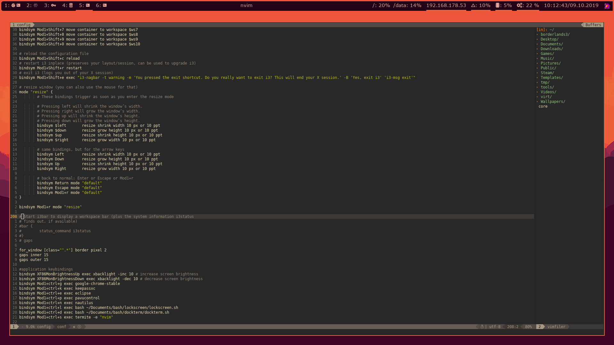

# dotfiles

## Keybindings
Default i3 but some added

alt + ctrl + g = brave  
alt + ctrl + k = keepassxc  
alt + ctrl + p = pavucontrol  
alt + ctrl + l = lockscreen  
alt + ctrl + d = dockterm  
alt + ctrl + s = new nvim Window  
alt + b = background  
alt + m = screen off  
print = flameshot  

## Tools i use on my Desktop:
Window manager  
https://github.com/Airblader/i3  

Theme manager  
https://github.com/dylanaraps/pywal   

Bar  
https://github.com/polybar/polybar  

alacritty  
https://github.com/alacritty/alacritty  

icons  
https://github.com/ryanoasis/nerd-fonts  

screenshot  
https://github.com/lupoDharkael/flameshot  

## Tools i build for my Desktop:
lockscreen  
https://github.com/micmine/lockscreen  

testing  
https://github.com/micmine/dockterm  

wallpaper manager  
https://github.com/micmine/background  

puh  
https://github.com/micmine/puh  

## Wallpapers
The Wallpapers in this repository are not mine I don't have any rights on them.
If this is a problem for your copyright I can link you ore your picture.
